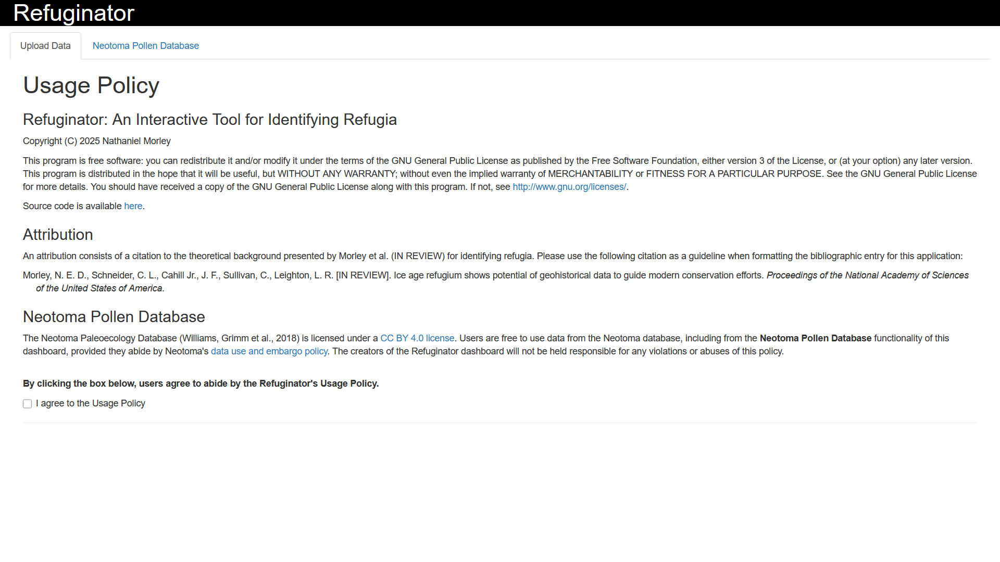
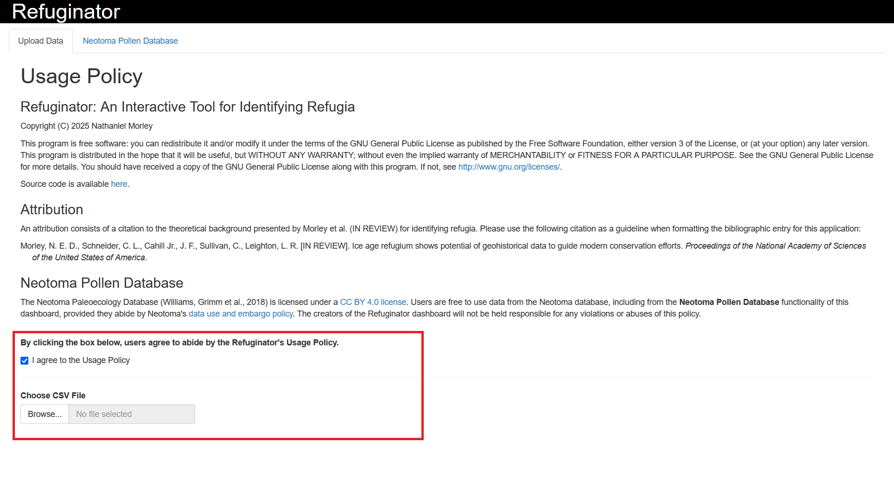
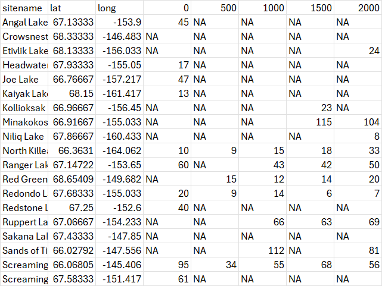
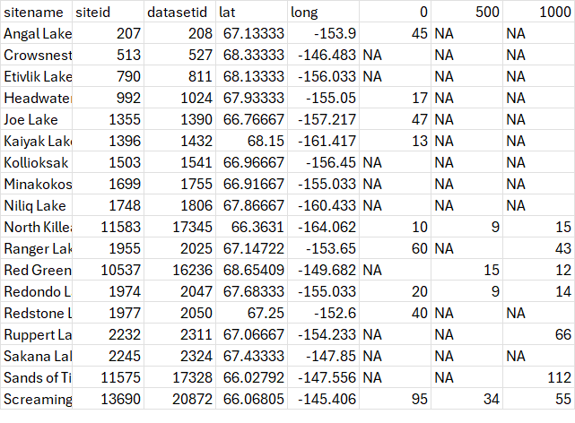
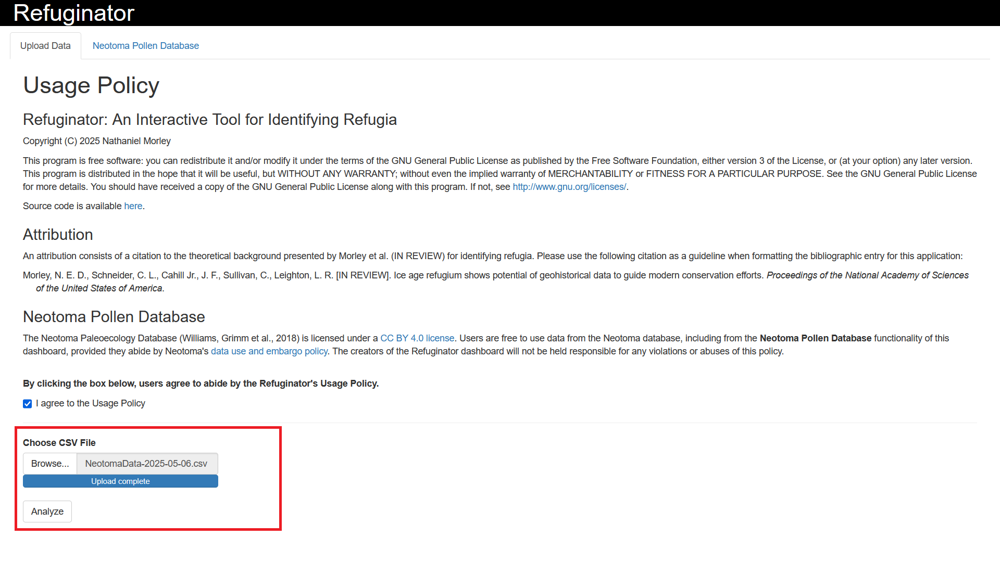

```{r, include = FALSE}
knitr::opts_chunk$set(
  collapse = TRUE,
  comment = "#>"
)
```

The Refuginator is a dashboard designed to facilitate the identification of historical and geohistorical refugia using the methods proposed by Morley et al. (2025). This vignette provides users a comprehensive walkthrough on how to launch and use the Refuginator dashboard using the `refuginator` package in `R`.

## Sections

* [Getting Started]
* [Upload Data]
* [Regional Analysis]
  * [Localities Data Over Time]
  * [Geospatial Heat Map]
  * [Monte Carlo Analysis]
* [Neotoma Pollen Database]
  * [Search Parameters]
  * [Interface Instructions]
  * [Neotoma Usage Policy]
* [References]


## Getting Started

Users can install the `refuginator` package from CRAN with the command:

```{r, eval = FALSE}
install.packages("refuginator")
```

Once the package is installed, users can then launch the Refuginator dashboard by attaching the `refuginator` package and using the `launchRefuginator()` command:

```{r, eval = FALSE}
library(refuginator)
launchRefuginator()
```

Or, if users prefer to attach the package directly in the function's namespace:

```{r, eval = FALSE}
refuginator::launchRefuginator()
```


## Upload Data

Upon launching the dashboard, users will be directed to the "Upload Data" tab. This page shows users the usage policy for the Refuginator and explains the correct attribution for this application.

```{r echo=FALSE, out.width = "90%", fig.cap = cap}

cap = "**Figure 1**. Refuginator landing page."
```

After agreeing to the usage policy, a button will appear that allows users to upload their dataset:

```{r echo=FALSE, out.width = "90%", fig.cap = cap}

cap = "**Figure 2**. Agreeing to the Usage Policy allows users to upload their data."
```

Users can upload custom geospatial data as CSV files for regional analysis. The spreadsheets must be formatted to contain the following columns:

* *sitename* – the name of the site
* *lat* – the latitude for the site
* *long* – the longitude for the site
*  Proceeding columns must be numerical dates and should increase in regular increments (e.g., 0, 500, 1000, 1500). 

Each entry should show the number of specimens for the user's taxon of interest in a given locality for the corresponding time interval. Entries for which data are unavailable should be left blank; entries for which data are available but lack examples of the user's taxon of interest should be marked as "0."

An example of the formatting required for a custom geospatial dataset is shown below:

```{r echo=FALSE, out.width = "90%", fig.cap = cap}

cap = "**Figure 3**. Example dataset with the *sitename*, *latitude*, and *longitude* columns."
```

Data downloaded from the [Neotoma Pollen Database] feature of the Refuginator will contain two extra columns (*siteid* and *datasetid*) following the *sitename* column. These columns provide information for users to help fulfill the Neotoma Database’s Usage Policy. Spreadsheets with the *siteid* and *datasetid* column can be uploaded directly to the Refuginator for analysis. An example of the formatting required for a ready-to-use Neotoma dataset can be found below:

```{r echo=FALSE, out.width = "90%", fig.cap = cap}

cap = "**Figure 4**. Example dataset including the *siteid* and *datasetid* columns."
```

After uploading the data, a button marked "Analyze" will appear. Clicking this button will launch a separate tab on the application where the analysis will take place.

```{r echo=FALSE, out.width = "90%", fig.cap = cap}

cap = "**Figure 5**. Once the data is uploaded, the Analyze button will appear."
```


## Regional Analysis
### Localities Data Over Time

The first step in Morley et al.'s (2025) protocol is to look at presence data over time. In the top right-hand corner of the [Regional Analysis] tab should be a line plot with two lines. The red line, marked "localities_with_data," shows the the number of sites with data in the user's study area in a given time bin; the blue line, marked "localities_with_specimens," shows the number of sites where the user's taxon if interest is present. 

The regional presence plot is rendered with the `plotly` package, allowing users to interact with the plot using the toolbar on the upper right corner of the plot. By default, the "Compare data on hover" tool is selected, but we recommend that users click the "Show closest data on hover" tool. This allows users to see exactly how many sites are present at a given time.

Users can also download the plot as a .png file using the "Download plot as a png" tool.

### Geospatial Heat Map

The second step in Morley et al.'s (2025) protocol is to examine an animated heat map to determine how taxon abundance changes site-to-site for the duration of the study interval. Scrolling down on the [Regional Analysis] tab should show a still heatmap of the oldest time interval in the study.

Pressing the "Play Animation" button should start the animation, moving from the oldest time interval to the youngest time interval. The "Pause Animation" button should stop the animation. Once paused, users can use the "Select Time" bar to skip forward or backward in the sequence. 

Users can press the "Download Animation" button if they want to save a .gif of their animated heatmap.


### Monte Carlo Analysis

The final step in Morley et al.'s (2025) protocol is to perform a Monte Carlo analysis to identify whether there is a statistically significant decline and rebound in the taxon of interest's presence. To do this, users must input:

* **Entry Presence.** The presence at which the localities with data and the localities with specimens begin to diverge.
* **Decline Presence.** The maximum presence at which the the localities with specimen occurs during the decline interval. *e.g., If decline presence = 5, the presence would be 5 or less for the duration of the decline*
* **Duration of Decline.** How many time bins the decline lasts before re-expanding past the decline presence.
* **Number of Iterations.** How many iterations users want to run for the Monte Carlo analysis. Typically values of 10,000 or 100,000 are sufficient.

After users press the "Calculate" button, the Refuginator will provide a realized p-value.


## Neotoma Pollen Database
### Search Parameters

To extract data from the Neotoma database, users are required to enter the following search parameters:

* **Coordinates.** The algorithm will search for pollen cores within a bounding box defined by the coordinates parameters. The Western Longitude and Eastern Longitude define the longitudinal axis, while the Southern Latitude and Northern Latitude define the latitudinal axis.
* **Taxon of Interest.** The algorithm will filter data from select cores to only include pollen data based on the user's taxon of interest. When searching for the user's desired taxon, the dashboard will collapse any lower-level taxa into the user's taxon of interest. (e.g., If a user searches for the genus Picea, any species-level results within that search term, such as Picea glauca or Picea mariana, will be lumped together). It is generally recommended that searches are limited to the generic level (see Morley et al., 2024).
* **Time Parameters.** The algorithm will sort pollen data into the selected time parameters. The Beginning of Interval defines the start of the study interval, while the End of Interval defines the end of the study interval. Both of these values should be written in units of ya, or "years ago." (e.g., A study interval of 20 ka–Present would be input as "Beginning of Interval = 20000" and "End of Interval = 0"). The Time Bin parameter defines to the temporal resolution of the study (e.g., one datapoint for every 500 years). The Sampling Protocol defines how the data are sorted into time bins: the "Minimum" selects the lowest abundance in the time bin as the representative datapoint, while the "Maximum" selects the greatest abundance in the time bin as the representative datapoint (see Morley et al., 2024 for more information on these two protocols).

### Interface Instructions

After users input their search parameters, the Refuginator will display a preview of all of the pollen cores identified in the study area, including cores where the user's taxon is absent. Given the size of many Neotoma datasets, this allows users to check their selection's metadata without devoting too much computing power to retrieve the data itself; however, this can still take some time, depending on factors such as search size and internet speed. At this point, users will be given the opportunity to proceed with the extraction or input new search parameters.

If the user proceeds with the selection, the dashboard will download the data for their selected cores and filter the data to only include pollen data based on their selected taxonomic and temporal parameters. A snippet of the resultant spreadsheet will be displayed on the dashboard with all of the information necessary for citing the individual cores from the Neotoma database. From here, users can download the full spreadsheet as a .csv file. This .csv file can subsequently be uploaded directly under the [Upload Data] tab for analysis, or users can further modify it based on the requirements for their project.

### Neotoma Usage Policy

The Neotoma Paleoecology Database (Williams, Grimm et al., 2018) is licensed under a CC BY 4.0 license. Users are free to use data from the Neotoma database, including from the Neotoma Pollen Database functionality of this dashboard, provided they abide by Neotoma's data use and embargo policy. The creators of the Refuginator dashboard will not be held responsible for any violations or abuses of this policy.


## References

Morley, N. E. D., Schneider, C. L., Cahill Jr., J. F., Sullivan, C., Leighton, L. R. [IN REVIEW]. Ice age refugium shows potential of geohistorical data to guide modern conservation efforts. *Proceedings of the National Academy of Sciences of the United States of America.* 

Williams, J. W., Grimm, E. C., Blois, J. L., Charles, D. F., Davis, E. B., Goring, S. J., Graham, R. W., Smith, A. J., Anderson, M., Arroyo-Cabrales, J., Ashworth, A. C., Betancourt, J. L., Bills, B. W., Booth, R. K., Buckland, P. I., Curry, B. B., Giesecke, T., Jackson, S. T., Latorre, C., … Takahara, H. (2018). The Neotoma Paleoecology Database, a multiproxy, international, community-curated data resource. *Quaternary Research*, 89(1), 156–177. https://doi.org/10.1017/qua.2017.105
